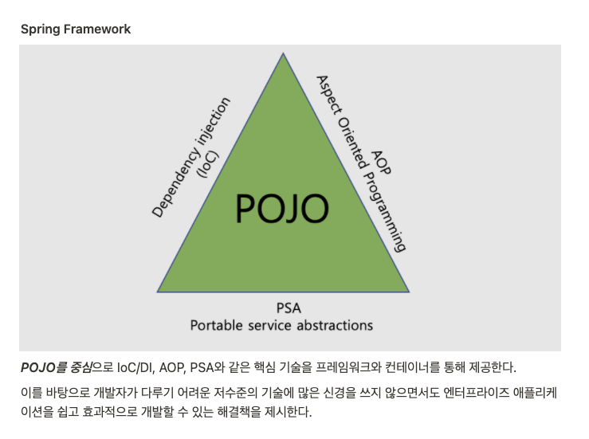
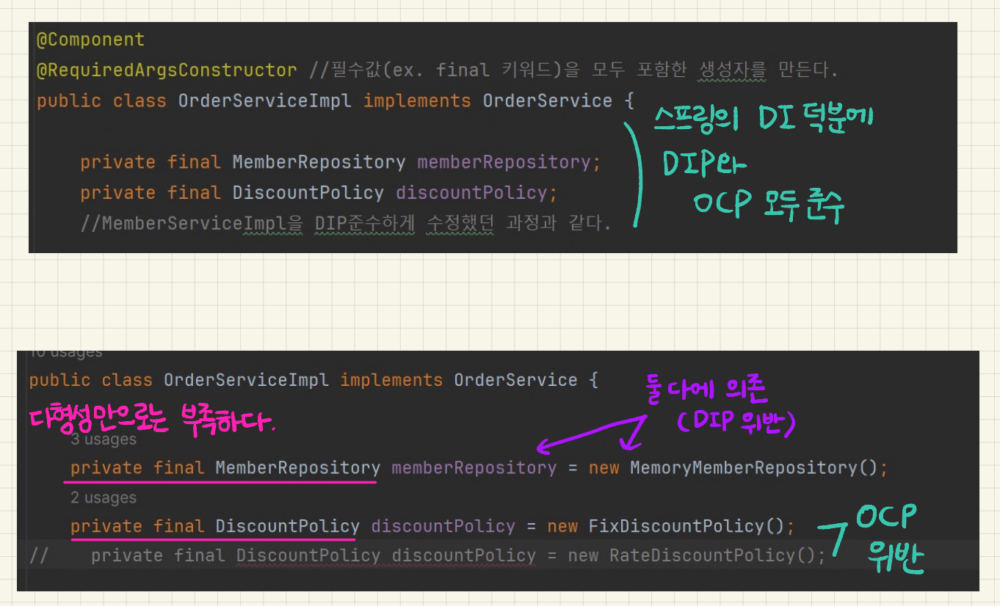

> [김영한님의 스프링 로드맵](https://www.inflearn.com/roadmaps/373)을 수강하며 공부한 내용을 개인적으로 정리한 글입니다.

- **핵심 키워드** 
: `EJB`, `POJO`, `SPRING`, `HIBERNATE`, `JPA`, `OOP`, `SOLID`, `DI`, `IoC`, `AOP`, `PSA`

# Section 1. 객체 지향 설계와 스프링
## [스프링의 탄생 배경]
- #### J2EE (Java 2 Platform, Enterprise Edition) / JakartaEE  
  : 자바를 기반으로 Enterprise 어플리케이션을 만드는데 필요한 표준 사양의 집합(API).  
    JSP, Java Servlet, **EJB(핵심)**, JDBC 등을 포함   
- #### EJB (Jakarta Enterprise Beans)와 POJO (Plain Old Java Object)  
  : 복잡한 설정과 EJB에 종속적인 코드(EJB 인터페이스에 의존, 유연성 떨어짐),  
  테스트 자동화의 어려움 등 복잡한 프로그래밍과 낮은 생산성을 야기
   특정 프레임워크나 사양에 종속적이지 않은 POJO가 인기를 얻는다.  
- #### JavaBeans   
 : 특정 규칙을 따르는 POJO
  1. private 접근제어자 멤버변수 + public getter/setter
  2. getter/setter 네이밍 : getX / setX
  3. 기본 생성자
  4. 클래스가 default가 아닌 특정 패키지에 속할것
  5. 직렬화 가능 (implements Serializable)
- #### 기존 EJB 컨테이너 기술은 Spring으로,    
EJB ORM기술(Entity Beans)은 Hiberante(-> 후에 JPA)로 대체되게 된다.

------------------

## [스프링이란?]
- #### from Winter(EJB) to Spring   
  : Spring은 로드 존슨을 시작으로 유겐 휠러, 얀 카로프 등의 오픈소스 프로젝트로 시작. EJB와 달리 POJO를 이용한 프레임워크.
- #### 스프링 프레임워크의 기술    
  : DI 컨테이너, AOP, 이벤트, 스프링 MVC, Tx, JDBC, ORM 등 다양한 기술을 지원
- #### 스프링부트   
  : 내장 톰캣, starter를 통한 손쉬운 설정과 build -> 보다 스프링을 편리하게 사용 가능
- #### 스프링의 핵심   
  : _**좋은 객체 지향 어플리케이션의 개발**_

------------------

## [OOP와 SOLID]
- #### OOP란?   
: _컴퓨터를 명령어의 목록으로 보는 시각에서 벗어나 ** "객체"들의 "협력" **으로 보는 프로그래밍.     
보다 유연하고 변경에 용이한 프로그램을 만들 수 있다._
- #### OOP (Obejct Oriented Programming) 4대 특징
  - **캡**슐화   
   : 정보은닉(데이터 보호), 내부적으로만 쓰이는 부분을 감춰 복잡도를 감소. cf. 접근제어자 private
  - **상**속 : 코드의 재사용과 확장
  - **추**상화 : 공통요소를 뽑아내기, 모델링
  - **다**형성   
  : 상위 타입 참조변수로 하위 타입 인스턴스를 참조할 수 있다.   
  -> ex. 매개변수의 다형성, 객체 배열 등
  
- #### 다형성의 의미
  - **역할**과 **구현**을 나누는 것  
  (운전자는 자동차의 세부 종류를 알 필요 없이 운전할 수 있다.  
  배우는 상대 배우의 구체적인 정보를 알 필요 없이 함께 연기할 수 있다.)
  - 즉, 클라이언트는 대상의 **역할(인터페이스)** 만 알면된다.  
    클라이언트가 **구현** 대상을 알지 않아도 된다.  
    즉, 클라이언트 코드는 구현대상의 변경에 영향받지 않는다. **(OCP)**  
    **클라이언트를 변경하지 않고, 서버의 구현 기능을 유연하게 변경할 수 있다.**  
   

- #### SOLID
  - **SRP** (Single Responsibility Principle)  
    : responsibility = reason to change  
    **" 어떤 클래스를 변경해야 하는 이유는 오직 하나뿐이어야 한다. "**    
    한 모듈이 여러 책임을 가지면 여러가지 이유로 모듈에 변경이 생길 수 있으므로, 한 모듈은 하나의 책임을 가진다.   
  
  - **OCP** (Open Closed Principle)  
    : **" 소프트웨어 엔티티(클래스, 모듈, 함수)는 확장에 대해서는 열려있지만 변경에 대해서는 닫혀있어야 한다. "**    
    유연함에 대한 원칙. **추상화와 다형성**을 활용해서 OCP를 구현. ex) JDBC 인터페이스   
  
  - **LSP** (Liskov Substitution Principle)  
    : **" 서브타입은 언제나 자신의 기반타입으로 교체할 수 있어야 한다. "**  
      하위 클래스의 인스턴스는 상위 타입 참조변수에 대입되어 상위 클래스의 인스턴스 역할을 하는데 문제가 없어야 한다.  
      개념적으로 슈퍼-서브타입(상속)일 뿐 아니라 실제 기능/구현으로도 슈퍼-서브타입(상속)이어야 한다. (직사각형- 정사각형 문제)  
  
  - **ISP** (Interface Segregation Principle)
     : **" 클라이언트는 자신이 사용하지 않는 메서드에 의존 관계를 맺으면 안된다. "**  
      범용적인 인터페이스 하나보다 구체적인 인터페이스 여러개가 낫다.   
      -> SRP와도 연결된다.  
      cf) 인터페이스 최소주의 원칙 : 인터페이스를 통해 메서드를 외부에 제공할 때는 최소한의 메서드만 제공한다.

  - **DIP** (Dependency Inversion Principle)
    : **" 고차원 모듈은 저차원 모듈에 의존하면 안된다.**  
     **이 두 모듈 모두 다른 추상적인 것에 의존해야 한다. "**   
     **" 추상화된 것은 구체적인 것에 의존하면 안된다. "**  
     **" 자주 변경되는 구체클래스에 의존하지 마라"**   
     **" 구현에 의존하지 말고 역할에 의존하기 "**   
  
------------------
  
## [스프링과 객체 지향 설계]

- #### 스프링 삼각형
  - IoC(Inversion of Control)  
  : 기존의 flow of control은 개발자가 필요한 라이브러리 코드를 호출하는 방식이었다면,   
제어의 역전에서는 프레임워크가 개발자의 코드를 호출한다.    
  흐름에 대한 제어권이 개발자에게서 프레임워크로 넘어감.   
  (참고: 모든 IoC가 DI인 것은 아니다. DI는 IoC의 한 형태)  
  
  - DI(Dependency Injection)  
  : 의존 객체를 내부에서 직접 생성하는 것은 DIP를 위반하게 된다. (OCP를 위반할 가능성 역시 있다.)   
   new 연산자를 사용하는 것은 어떤 의미에서 하드코딩에 가깝다.   
  DI란, 외부로부터 필요한 객체를 넣어주는 것을 의미. 모듈간의 결합도 감소, 유연성 증가.    
  ex) 생성자 주입, 속성을 통한 주입(setter)이 DI의 형태   
    - 스프링을 통한 DI    
  : 스프링 컨테이너가 객체의 생명주기를 관리하며
컨테이너에 등록, 관리되는 bean으로 의존성을 주입(DI)해준다 (ex. @Autowired, config를 통한 주입)    
이로써 객체는 오로지 자신의 로직을 실행하는 역할만 담당하게 된다.  
인터페이스에 의존한 채 실행중 어떤 구현 객체를 사용하게 되는지 알 필요가 없다.  
    cf. 수동 빈 등록(@Bean) / 자동 빈 등록(@Component)  
    설정파일을 통한 DI / @Autowired(자동 DI)    
    cf. 필드 주입, setter주입, 생성자 주입 중 생성자 주입을 권장    
    -> 컴파일러에 의한 체크 가능하기 때문.  
   
    
  - AOP(Aspect-Oriented Programming)  
  : 다수의 모듈에서 공통적으로 나타나는 부분(횡단 관심사, cross-cutting concern)를 분리하는 것. -> SRP, OCP 등을 준수 할 수 있다.  
  ex) @Transactional, logging 등.   
  
  - PSA(Portable Service Abstraction)
  : 일관성있는 서비스 추상화  
  어댑터 패턴을 적용해 같은 일을 하는 다수의 기술을 공통의 인터페이스로 제어할 수 있게 하는 것.  
  ex. JDBC API
    
- 스프링과 객체 지향

  - 다형성만으로는 OCP와 DIP를 모두 준수하기가 힘들다.  
  - 스프링 컨테이너를 통한 DI는 다형성을 극대화해서 사용할 수 있도록 도와준다    
  -> 보다 객체 지향적인 프로그램을 만들 수 있는 프레임워크.  
- 실무적 관점의 고찰  
: 추상화도 비용이다. 확장 가능성이 있는 기술에 인터페이스를 도입.    
그렇지 않은 경우, 구체클래스를 직접 사용하고 추후에 리팩토링을 권장.  

------------------

[참고 자료]
https://en.wikipedia.org/wiki/Jakarta_EE  
https://www.baeldung.com/spring-bean-vs-ejb  
https://www.baeldung.com/java-pojo-class  
https://www.nextree.co.kr/p6960/  
http://principles-wiki.net/principles:single_responsibility_principle  
https://koseungbin.gitbook.io/wiki/books/undefined/part-2.-di/solid/liskov-substitution-principle  
책 : [스프링 입문을 위한 자바 객체 지향의 원리와 이해 - 김종민]  
https://brewagebear.github.io/spring-triangle/  
https://www.theserverside.com/definition/inversion-of-control-IoC  
https://en.wikipedia.org/wiki/Dependency_inversion_principle  
[스프링 삼각형 이미지 출처]  : https://velog.io/@mertyn88/클린-아키텍쳐-5주차

